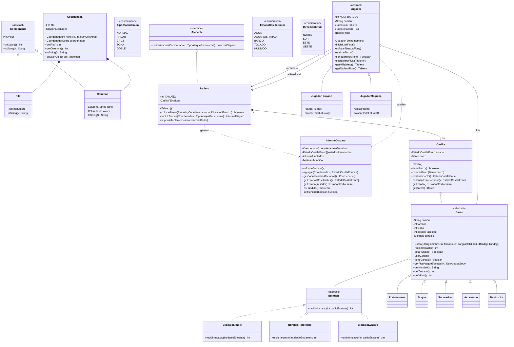
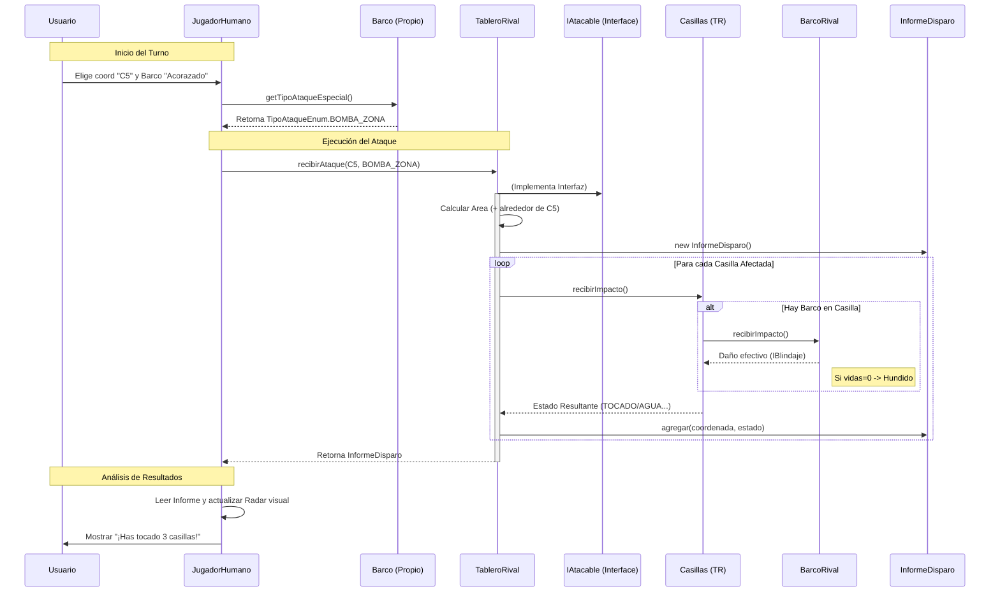
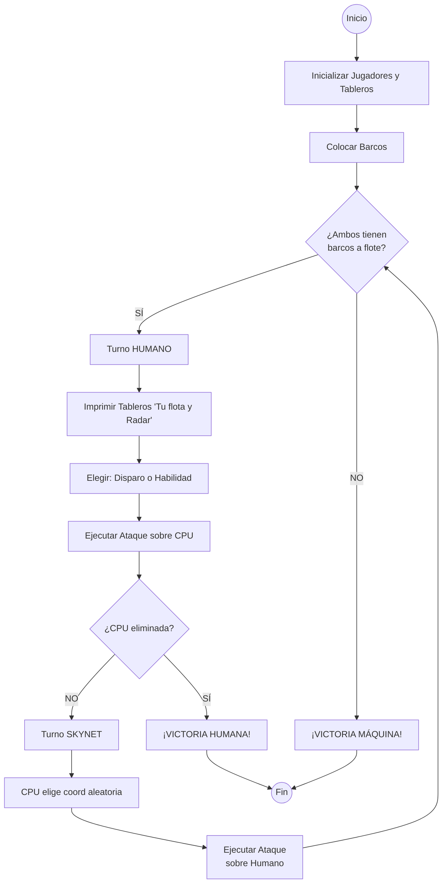

# 🚢 B07.2 Reto: Hundir la Flota (Edición POO)

En este reto vamos a diseñar un simulador de batalla naval avanzado. No se trata solo de "jugar", sino de aplicar **ingeniería de software** para modelar entidades complejas, sus comportamientos y cómo interactúan entre sí utilizando **Orientación a Objetos (POO)**.

En lugar de ver el juego como una cuadrícula de números, lo veremos como un ecosistema de objetos: **Barcos** con sistemas de defensa, **Coordenadas** inteligentes, **Tableros** que gestionan impactos y **Jugadores** con distintas estrategias.

---

## 🎯 Objetivo

Completar el código base proporcionado para que el juego sea plenamente funcional. El juego permite colocar barcos de forma aleatoria en un tablero de 10x10 y jugar contra otro humano o contra la máquina.


## 🏗️ Estructura de Datos

El juego se basa en una matriz bidimensional de 10x10 del elemento `Casilla`. Cada casilla de la matriz puede ser uno de los siguientes valores del enumerado `EstadoCasillaEnum`:

- Agua: Indica que no hay nada en la casilla. 
- Barco: Indica que hay un barco en la casilla.
- Tocado: Indica que un barco ha sido alcanzado.
- Agua disparada: Indica que se ha disparado a una casilla con agua.
- Hundido: Indica que el barco de esa casilla ha sido destruido por completo.

**Un barco puede estar repartido entre varias casillas, dependiendo de su tamaño. **

## 🕹️ Dinámica y Componentes

### 1. El Sistema de Localización

Las coordenadas no son simples números. Son objetos compuestos:

*   **Fila/Columna**: Heredan de un `Componente` base. Se encargan de la traducción entre el mundo del usuario ("A", "5") y el mundo del programador (índices 0-9).
*   **Coordenada**: Combina una Fila y una Columna. Su constructor debe ser capaz de "romper" un String como `"B7"` y crear los componentes adecuados.

### 2. Tecnología Naval y Defensa (Composición & Estrategia)

Cada barco *tiene un* **`IBlindaje`**. Este es un ejemplo de **Composición**. 

*   **BlindajeSimple**: Recibe el daño tal cual.
*   **BlindajeReforzado**: La primera vez que lo golpean, el daño es 0 (el escudo se rompe). Después actúa como uno simple.
*   **BlindajeEvasivo**: Tiene probabilidad (ej. 20%) de esquivar el disparo.

### 3. La Flota y sus Habilidades (Polimorfismo)

Cada tipo de barco tiene **personalidad propia** definida por sus habilidades.

#### ⚙️ Mecánica de Cargas y Habilidades

Todos los barcos tienen un atributo `cargasHabilidad` (munición especial).

1.  **Activación**: El jugador decide usar la habilidad de un barco específico en su turno en lugar de un disparo normal.
2.  **Consumo**: Al usar la habilidad, se resta 1 carga. Si no quedan cargas, no se puede usar.

#### Tipos de Barcos (Subclases)

Debes implementar las siguientes clases concretas.

| Clase | Tamaño | Cargas | Habilidad Especial | Efecto |
| :--- | :---: | :---: | :--- | :--- |
| **`Portaaviones`** | 5 | 1 | **Reconocimiento Aéreo** | Revela el estado (Agua/Barco) de un área de **3x3** alrededor del objetivo sin dañar. |
| **`Buque`** | 4 | 1 | **Ataque en Cruz** | Dispara a **toda la fila y toda la columna** de la coordenada indicada. |
| **`Submarino`** | 3 | 1 | **Inmersión** | Se vuelve invulnerable a los disparos rivales durante el **siguiente turno**. |
| **`Acorazado`** | 4 | 1 | **Bombardeo en Zona** | Impacta en la coordenada objetivo y en las 4 casillas adyacentes (+). |
| **`Destructor`** | 2 | 2 | **Disparo Doble** | Permite disparar de nuevo en el mismo turno. |

> Nota: El tamaño indica el nº de casillas que ocupa un barco.

### 🌡️ Ciclo de Vida de un Barco

Un barco pasa por tres estados lógicos:

1.  **Intacto**: Todas sus casillas tienen su número original `barco`.
2.  **Tocado**: Al menos una de sus casillas ha pasado a ser `tocado`, pero aún quedan casillas con su número original.
3.  **Hundido**: Todas las casillas que componían ese barco son ahora `tocado`.


## 🏗️ El Diseño del Sistema

El proyecto sigue una estructura profesional organizada por **responsabilidades funcionales**. Esto facilita la mantenibilidad y permite aplicar principios de **Arquitectura Limpia**, separando el dominio (naves), la infraestructura espacial (localización) y las reglas de negocio (juego).

### 📂 Organización de Paquetes

Se recomienda agrupar las clases según su propósito para mantener una alta cohesión:

```text
com.pg.poo.hundirflota
├── app                  <-- Punto de entrada y orquestación
│   └── Juego.java
│
├── core                 <-- El "Motor": Lógica pura que no cambia
│   ├── Tablero.java
│   ├── Casilla.java
│   ├── IAtacable.java (Interface)
│   └── InformeDisparo.java
│
├── localizacion         <-- El "Mapa": Tipos de datos espaciales
│   ├── Coordenada.java
│   ├── Fila.java
│   ├── Columna.java
│   ├── Componente.java
│   └── DireccionEnum.java (Enum)
│
├── naves                <-- El "Cofre": Unidades y sus variaciones
│   ├── base             <-- Clase base y contratos
│   │   ├── Barco.java
│   │   ├── IBlindaje.java (Interface)
│   │   └── TipoAtaqueEnum.java
│   ├── tipos            <-- Implementaciones concretas de barcos
│   │   ├── Submarino.java, Buque.java, etc.
│   └── defensa          <-- Implementaciones de blindajes
│       ├── BlindajeSimple.java, BlindajeEvasivo.java...
│
├── jugadores            <-- La "IA y UI": Actores que toman decisiones
│   ├── Jugador.java
│   ├── JugadorHumano.java
│   └── JugadorMaquina.java
│
└── test 
```

### 📊 Diagrama de Clases


Este es el mapa de nuestra aplicación. Observa con atención las relaciones de **Herencia** (triángulos) y **Composición/Agregación** (rombos/líneas).



---


---

### � Flujo del Turno (Diagrama de Secuencia)

El siguiente diagrama muestra paso a paso qué ocurre cuando un jugador decide atacar. Estudia este flujo para entender cómo interactúan los objetos.



---

### 🗺️ 4. La Clase `Tablero` y el `InformeDisparo`

El tablero no solo recibe un disparo, sino que gestiona ataques complejos y devuelve un informe detallado.

Un tablero está compuesto por un array de 10x10 de casillas. Cada casilla contiene un barco o agua, y un barco puede ocupar varias casillas.


#### 4.1 La Clase `InformeDisparo` (El Mensajero)
Es un objeto que encapsula **todo lo ocurrido** durante un ataque. Se usarán arrays con capacidad suficiente.

- **Atributos**:
    - `Coordenada[] coordenadasAfectadas`: Array de tamaño fijo (ej: 20 posiciones).
    - `EstadoCasillaEnum[] estadosResultantes`: Array paralelo con el resultado en cada coordenada.
    - `int numAfectados`: Contador real de casillas almacenadas.
    - `boolean hundido`: Indica si algún barco se hundió en este ataque.

#### 4.2 Interfaz `IAtacable`
Define el contrato para procesar cualquier tipo de amenaza.

```java
public interface IAtacable {
    // Recibe coordenada y tipo de arma (Enum)
    InformeDisparo recibirAtaque(Coordenada c, TipoAtaqueEnum arma);
}
```

#### 4.3 Enum `TipoAtaqueEnum`
Define los tipos de ataque posibles para simplificar la lógica del Tablero:
- `NORMAL` (1 casilla)
- `RADAR` (3x3, sin daño)
- `CRUZ` (Fila/Columna)
- `ZONA` (Cruz +)
#### 4.4 Gestión Visual (`imprimirTablero`)
El tablero debe saber dibujarse en la consola. La visualización depende de quién lo mira:
1.  **Vista Propia (`esModoRadar = false`)**: Muestra **todo**: tus barcos (B), agua, impactos.
2.  **Vista Rival (`esModoRadar = true`)**: Muestra **solo lo público**: agua disparada y tocados. **NUNCA** muestra barcos intactos (deben aparecer como agua o el color del mar).

```java
public void imprimirTablero(boolean esModoRadar) {
    // Ver ejemplo detallado con ConsoleHelper en el Anexo A.2
}
```

#### 4.5 Composición de la Flota
Cada jugador comienza con una flota de **5 barcos** (un `Barco[]` de tamaño 5). El proceso tiene dos fases:
1.  **`inicializarFlota()`**: Se instancian los objetos (1 Portaaviones, 1 Buque, 1 Submarino, 1 Acorazado y 1 Destructor). Se debe asignar un blindaje a cada uno.
2.  **`colocarTodaLaFlota()`**: Se recorre el array de barcos y se llama a `miTablero.colocarBarco(...)` para cada uno hasta que todos estén posicionados válidamente.

---

### � 5. Flujo Principal del Juego (Game Loop)

Este diagrama resume el ciclo de vida de una partida completa.



---

### �👤 6. La Jerarquía `Jugador`

Aquí reside la inteligencia del juego y la gestión del turno.

- **Clase Abstracta `Jugador`**:
    - **Atributos**:
        - `miFlota`: Array de mis barcos.
        - `tableroRival`: Referencia al tablero del oponente.
    - **Método Principal**: `void realizarTurno()`.
        - Ejecuta todo el ciclo (ver diagrama de flujo):
        1.  Decide si dispara normal o usa habilidad.
        2.  Si usa habilidad, selecciona qué barco propio la ejecuta.
        3.  Llama a `tableroRival.recibirAtaque(...)`.
        4.  Recibe el `InformeDisparo` y actualiza su radar.

#### Subclases

- **`JugadorHumano`**:
    - Muestra menú: "1. Disparo Normal, 2. Habilidad Especial".
    - Si elige 2, muestra lista de barcos con cargas disponibles.
- **`JugadorMaquina`**:
    - Elige aleatoriamente.
    - (Opcional) Si tiene cargas y ve oportunidad, las usa.

---

## 🧪 Guía de Testing: ¿Qué debo verificar?

El uso de **Tests Manuales con `assert`** es obligatorio. Debes crear una clase de prueba por cada componente principal (`TestCoordenada`, `TestBarco`, etc.) y verificar los siguientes escenarios críticos.

> recuerda ejecutar con `-ea` (Enable Assertions).

### 1. 📍 Pruebas de Localización (`TestCoordenada`)
- [ ] **Constructor Numérico**: `new Coordenada(0, 0)` crea la "A-1".
- [ ] **Constructor String**: `new Coordenada("C5")` crea correctamente fila 4 (índice) y columna 2 (índice).
- [ ] **Límites**: `new Coordenada("J10")` debe ser válida (9, 9).
- [ ] **Igualdad**: Dos objetos `new Coordenada("A1")` distintos deben ser `equals() == true`.

### 2. 🛡️ Pruebas de Defensa (`TestBlindaje`)
- [ ] **Blindaje Simple**:
    - Al recibir 1 de daño, devuelve 1.
- [ ] **Blindaje Reforzado**:
    - Primer impacto: devuelve 0 (absorbido).
    - Segundo impacto: devuelve 1 (ya roto).
- [ ] **Blindaje Evasivo** (Probabilístico):
    - *Nota*: Difícil de probar deterministamente. Puedes hacer un bucle de 100 impactos y verificar que *aproximadamente* 20 fueron esquivados, o simplemente probar que a veces devuelve 0 y a veces 1.

### 3. 🚢 Pruebas de Flota (`TestBarco`)

Instancia barcos concretos (ej: `new Submarino(new BlindajeSimple())`) y verifica:

- [ ] **Vida Inicial**: Que coincide con la tabla (ej: Submarino = 3 vidas).
- [ ] **Daño**: Al llamar a `recibirImpacto()`, la vida baja.
- [ ] **Hundimiento**: Al recibir tantos impactos como vidas, `estaHundido()` devuelve `true`.
- [ ] **Integración con IBlindaje**: Un barco con BlindajeReforzado no debe perder vida en el primer golpe.

### 4. 🗺️ Pruebas de Tablero (`TestTablero`)

- [ ] **Colocación Válida**: Un barco cabe en el mapa y se guarda en las casillas.
- [ ] **Colocación Inválida (Límites)**: Intentar poner un Portaaviones (5) en "J10" hacia el ESTE debería devolver `false` (se sale).
- [ ] **Colocación Inválida (Solape)**: Intentar poner un barco donde ya hay otro (o pegado) debe fallar.
- [ ] **Ataque**:
    - Disparar a AGUA -> Devuelve informe con `AGUA_DISPARADA`.
    - Disparar a BARCO -> Devuelve informe con `TOCADO` y baja vida al barco.
    - Disparar a TOCADO -> Debe indicar que ya estaba tocada.

### 5. 💥 Pruebas de Ataques Especiales (`TestAtaques`)
Simula un escenario con barcos enemigos conocidos y verifica:
- [ ] **Bomba Cruz (Buque)**: Al disparar a "C5", verifica que TODA la fila C y la columna 5 han sido afectadas en el informe.
- [ ] **Radar (Portaaviones)**: Al usar radar en "A1", verifica que recibes información de las casillas A1, A2, B1, B2 (esquina), pero que **su estado no cambia** a atacado.
- [ ] **Consumo**: Verifica que tras usar una habilidad, las `cargas` del barco bajan.

---

### 👥 Metodología de Trabajo: Ingeniería por Roles

Para este proyecto avanzado, dividiréis el desarrollo en dos frentes. Cada rol es responsable de sus paquetes y de que **pasen sus Tests**.

### 📐 Rol A: Arquitecto del Campo de Batalla

Eres el responsable del "mundo físico" y de procesar lo que ocurre en él.
*   **Misión**: Crear el tablero, el sistema de coordenadas y **generar los reportes de daños**.
*   **Responsabilidades**:
    1.  **Fundamentos**: `Componente`, `Fila`, `Columna`, `Coordenada`.
    2.  **Terreno**: `Casilla` (gestión de estados) y `Tablero` (colocación y límites).
    3.  **Motor de Física**: Implementar la interfaz `Atacable` en el Tablero. Tú eres quien debe rellenar y devolver el objeto `InformeDisparo` cuando el rival ataca.
*   **Tu Meta**: Que `testCoordenada()` pase y que `Tablero.recibirAtaque(...)` devuelva un informe correcto con los arrays rellenos.

### 🎖️ Rol B: Almirante de Flota y Estrategia
Eres el responsable de las unidades de combate y de la inteligencia que las controla.
*   **Misión**: Crear los barcos, sus defensas y la lógica de los jugadores (Humano/IA).
*   **Responsabilidades**:
    1.  **Ingeniería Naval**: Interfaz `IBlindaje` (y sus 3 impl.) y Clase `Barco` (y sus 5 subclases). Define los `TipoAtaqueEnum` de cada nave.
    2.  **Mando y Control**: Clases `Jugador`, `JugadorHumano` y `JugadorMaquina`.
        *   Debes implementar el método `realizarTurno()`: decidir si disparar o usar habilidad, y llamar al tablero del Rol A.
*   **Tu Meta**: Que `testBarco()` y `testBlindaje()` pasen, y que los jugadores sepan gestionar sus cargas y turnos.

---

### 🤝 Fase de Integración (Conjunta)

Una vez que Rol A tenga el Tablero listo y Rol B tenga los Jugadores listos:

1.  Cread juntos la clase `Juego` (Main).
2.  Conectad los objetos: `jugador1.setTableroRival(jugador2.getMiTablero())`.
3.  ¡Ejecutad la simulación!
4.  Crea una carpeta `test` y añade clases de prueba para cada componente crítico.
5.  Asegúrate de que la jerarquía de barcos usa correctamente el **Polimorfismo**.
6.  Ensambla todo en la clase `Juego` y... ¡que comience la batalla!

---

## ⚓ Anexo: Guía de Implementación Mínima

Si te sientes perdido al empezar, aquí tienes los "ladrillos" básicos para las partes más técnicas.

### A.1 El Constructor de `Coordenada` (Parsing de Strings)

Para convertir `"C5"` en índices utilizables, puedes usar este enfoque:
```java
public Coordenada(String entrada) {
    // 1. Extraer la letra (0) y el número (desde 1 hasta el final)
    char letra = entrada.toUpperCase().charAt(0);
    String resto = entrada.substring(1);
    
    // 2. Convertir letra a índice (A=0, B=1...)
    int colIndex = letra - 'A';
    
    // 3. Convertir número a índice (1=0, 2=1...)
    int filaIndex = Integer.parseInt(resto) - 1;
    
    // 4. Instanciar componentes
    this.fila = new Fila(filaIndex);
    this.columna = new Columna(colIndex);
}
```

### A.2 La Lógica de `imprimirTablero` con `ConsoleHelper`

Para que el juego sea visualmente atractivo, utilizaremos la clase de utilidad `ConsoleHelper`. El tablero debe comportarse de forma distinta según si estamos viendo nuestra flota o la del rival (Modo Radar).

#### Paso 1: Inicialización
En el `main` de la clase `Juego`, lo primero es preparar la terminal:
```java
public static void main(String[] args) {
    ConsoleHelper.init();
    // ... resto del código
}
```

#### Métodos de Interés en `ConsoleHelper`
Para que el código sea más limpio, usa estos métodos en lugar de `System.out`:
*   `write(msg)`: Equivale a `System.out.print()`.
*   `writeLn(msg)`: Equivale a `System.out.println()`.
*   `writeColor(msg, color)`: Imprime con color y hace reset automático.
*   `writeColorLn(msg, color)`: Imprime con color, reset y salto de línea.
*   `clearScreen()`: Borra todo lo anterior en la terminal.

#### Paso 2: Implementación en `Tablero.java`

Aquí convertimos los estados en celdas de colores:

```java
public void imprimirTablero(boolean esModoRadar) {
    ConsoleHelper.writeLn("   A B C D E F G H I J"); 
    for (int f = 0; f < 10; f++) {
        System.out.printf("%2d ", f + 1); 
        for (int c = 0; c < 10; c++) {
            EstadoCasillaEnum st = celdas[f][c].getEstado();
            
            if (esModoRadar && st == EstadoCasillaEnum.BARCO) {
                ConsoleHelper.write(ConsoleHelper.cell("  ", ConsoleHelper.BG_BLUE));
            } else {
                String bg = obtenerColorSegunEstado(st);
                ConsoleHelper.write(ConsoleHelper.cell(st.getSimbolo(true), bg));
            }
        }
        ConsoleHelper.writeLn(""); 
    }
}

private String obtenerColorSegunEstado(EstadoCasillaEnum st) {
    switch (st) {
        case AGUA: case AGUA_DISPARADA: return ConsoleHelper.BG_BLUE;
        case BARCO: return ConsoleHelper.BG_WHITE;
        case TOCADO: return ConsoleHelper.BG_YELLOW;
        case HUNDIDO: return ConsoleHelper.BG_RED;
        default: return ConsoleHelper.RESET;
    }
}
```

### A.3 Delegación de Impacto (Barco -> Blindaje)

Es muy importante que el barco no gestione el daño él mismo:

```java
// En Barco.java
public int recibirImpacto() {
    // 1. Preguntamos al blindaje cuánto daño entra realmente
    int danioEfectivo = blindaje.recibirImpacto(1);
    
    // 2. Si entra daño, lo restamos de la vida
    if (danioEfectivo > 0) {
        this.vidas--;
    }
    
    // 3. Devolvemos lo que pasó para que la Casilla sepa qué hacer
    return danioEfectivo;
}
```

### A.4 El Bucle de Juego (Main)

```java
    // Cambiar de turno (actual = (actual == j1) ? j2 : j1;)
}
```

### A.5 Lógica de Colocación de Barcos

Colocar un barco no es solo poner una marca. Es un proceso de "todo o nada".

1.  **Cálculo**: Crea un array temporal de `Coordenada` con el tamaño del barco. Calcula dónde iría cada parte basándote en la `Direccion` (ej. si es ESTE, la columna aumenta en cada paso).
2.  **Validación**: Antes de modificar el tablero, recorre ese array temporal y comprueba:
    *   Que ninguna coordenada se salga del tablero (índices < 0 o > 9).
    *   Que ninguna casilla esté ya ocupada (`casilla.tieneBarco()`).
    *   *(Opcional)* Que no haya barcos vecinos (agua alrededor).
3.  **Ejecución**: Solo si **todas** las casillas son válidas, recorres el array de nuevo y llamas a `casilla.colocarBarco(b)`.

```java
// Esquema lógico en Tablero.java
public boolean colocarBarco(Barco b, Coordenada inicio, DireccionEnum d) {
    int tam = b.getTamano();
    // 1. Calcular y Validar primero...
    // 2. Si todo es OK, colocar:
    for (Coordenada c : coordenadasCalculadas) {
        celdas[c.getFila()][c.getCol()].colocarBarco(b);
    }
    return true;
}
```

